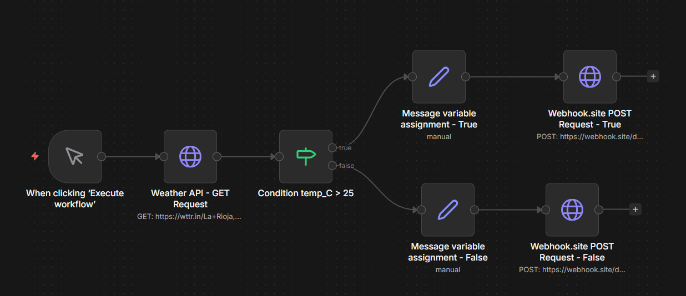

# Weather Notification Bot — n8n Workflow

An automated weather monitoring workflow built with n8n that fetches real-time weather data, applies conditional logic, and sends a formatted notification based on current temperature.

> Built as part of my automation portfolio. Demonstrates API integration, conditional branching, and webhook-based notifications using n8n.

---

## Demo



**Sample output received at webhook:**
```json
{
  "mensaje": "Fresco en La Rioja: 20°C - Sunny"
}
```

---

## How it works

```
Manual Trigger
  → Weather API - GET Request       (fetches real-time weather from wttr.in)
    → Condition: temp_C > 25        (conditional branch)
      → [true]  Message assignment  (formats "hot weather" message)
        → Webhook POST              (sends notification)
      → [false] Message assignment  (formats "cool weather" message)
        → Webhook POST              (sends notification)
```

### Nodes used

| Node | Type | Purpose |
|---|---|---|
| When clicking 'Execute workflow' | Trigger | Manual execution trigger |
| Weather API - GET Request | HTTP Request | Fetches JSON weather data from wttr.in |
| Condition temp_C > 25 | IF | Branches flow based on temperature |
| Message variable assignment | Set | Formats the notification message |
| Webhook.site POST Request | HTTP Request | Sends the result as a POST request |

---

## Tech stack

- **n8n** (self-hosted via Docker)
- **wttr.in** — free public weather API, no key required
- **webhook.site** — free webhook testing endpoint

---

## Getting started

### Prerequisites

- n8n running locally or self-hosted ([Docker setup guide](https://docs.n8n.io/hosting/installation/docker/))
- No API keys required

### Import the workflow

1. Clone this repository
```bash
git clone https://github.com/rafamurua/weather-notification-bot
cd weather-notification-bot
```

2. Open your n8n instance
3. Go to **Workflows → Import from file**
4. Select `weather-notification-bot.json`
5. Click **Execute workflow**

### Customize it

- **Change the city:** Edit the HTTP Request URL — replace `La+Rioja,Argentina` with your city
- **Change the threshold:** Edit the IF node condition — replace `25` with your preferred temperature
- **Change the destination:** Replace webhook.site URL with your Slack webhook, Gmail node, or any HTTP endpoint

---

## Project structure

```
weather-notification-bot/
├── weather-notification-bot.json   # n8n workflow export
├── workflow-screenshot.png         # Workflow visual overview
└── README.md
```

---

## What I learned

- Consuming a public REST API with n8n's HTTP Request node
- Using n8n expressions (`{{ $json.field }}`) to extract and transform JSON data
- Building conditional branching logic with the IF node
- Passing data between nodes using the Set node
- Sending POST requests with a JSON body as a notification mechanism

---

## Author

**Gabriel Murua** — Automation Engineer  
📍 La Rioja, Argentina | 🌐 Open to remote  
[GitHub](https://github.com/rafamurua) · [LinkedIn](https://www.linkedin.com/in/rafael-murua-192874153/)

---

## Next steps

This workflow is a foundation. Planned improvements:
- [ ] Replace manual trigger with a scheduled trigger (every morning at 8am)
- [ ] Add Telegram or Slack node instead of webhook.site
- [ ] Extend to multiple cities
- [ ] Add AI node to generate a natural language weather summary using OpenAI
